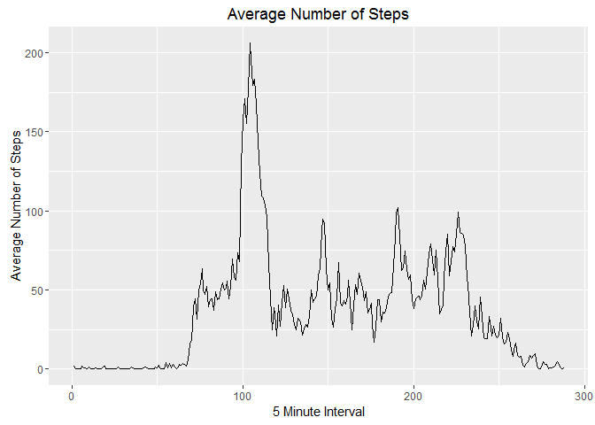

# PA1_template
Chris H.  

#Reproducible Research Project1!

Let's start by loading our data and libraries! We'll use the ggplot2 and dplyr libraries.

```r
library(ggplot2)
```

```
## Warning: package 'ggplot2' was built under R version 3.2.5
```

```r
library(dplyr)
```

```
## Warning: package 'dplyr' was built under R version 3.2.5
```

```
## 
## Attaching package: 'dplyr'
```

```
## The following objects are masked from 'package:stats':
## 
##     filter, lag
```

```
## The following objects are masked from 'package:base':
## 
##     intersect, setdiff, setequal, union
```

```r
filename <- "activity_data.zip"

if (!file.exists(filename)) {
  fileURL <-"https://d396qusza40orc.cloudfront.net/repdata%2Fdata%2Factivity.zip"
  download.file(fileURL,filename)
  unzip(filename)
}

activity <- read.csv("activity.csv",header=TRUE)
activity$interval <- as.factor(activity$interval)
activity$date <- as.Date(as.character(activity$date),"%Y-%m-%d")
```
Now we need to aggregate our data for total daily steps, and then plot a histogram of the results. We'll put this information in daily_totals.


```r
daily_totals <- activity %>% group_by(date) %>% summarize(steps = sum(steps,na.rm=TRUE))

qplot(daily_totals$steps,geom="histogram",xlab="Total Daily Steps",ylab="Number of Days",main="Total Daily Steps")
```

```
## `stat_bin()` using `bins = 30`. Pick better value with `binwidth`.
```

<!-- -->
I wonder what the mean and median daily total steps are? The below code should help with that.


```r
mean(daily_totals$steps)
```

```
## [1] 9354.23
```

```r
median(daily_totals$steps)
```

```
## [1] 10395
```

Actually, I'm more interested in learning about activity patterns throughout the day. Let's resummarize the data and plot activity by 5-minute interval!


```r
interval_averages <- activity %>% group_by(interval) %>% summarize(steps = mean(steps,na.rm=TRUE))

interval_averages$interval <- as.numeric(interval_averages$interval)

ggplot(data=interval_averages,aes(x=interval,y=steps,group=1),xlab="5 Minute Interval",ylab="Average Number of Steps",main="Average Number of Steps by 5 Minute Interval")+geom_line()+labs(x="5 Minute Interval",y="Average Number of Steps",title="Average Number of Steps")
```

<!-- -->
This makes ok sense to me... but I feel uncomfortable with all of these missing values... I wonder how many there are?


```r
sum(is.na(activity))
```

```
## [1] 2304
```
Yikes! Way too many. Let's make a new dataset and set those missing values equal to the average for the respective interval. We can compare a histogram of the new results against the old!

```r
nomiss <- activity %>% group_by(interval) %>% mutate(steps=ifelse(is.na(steps),as.integer(mean(steps,na.rm=TRUE)),steps))

daily_totals_nomiss <- nomiss %>% group_by(date) %>% summarize(steps = sum(steps,na.rm=TRUE))

qplot(daily_totals_nomiss$steps,geom="histogram",xlab="Total Daily Steps",ylab="Number of Days",main="Total Daily Steps - No Missing Values")
```

```
## `stat_bin()` using `bins = 30`. Pick better value with `binwidth`.
```

<!-- -->
Hmmm.... not unexpected. Definitely a shift towards the center. I wonder what our new median and mean are?

```r
mean(daily_totals_nomiss$steps)
```

```
## [1] 10749.77
```

```r
median(daily_totals_nomiss$steps)
```

```
## [1] 10641
```
Last question - do you think people have different activity patterns on the weekends than on weekdays? The following code should help us out.

```r
nomiss$weekday_ind <- weekdays(nomiss$date)
nomiss$weekday_ind <- ifelse(nomiss$weekday_ind %in% c("Saturday","Sunday"),"weekend","weekday")

interval_averages_nomiss <- nomiss %>% group_by(weekday_ind,interval) %>% summarize(steps = mean(steps,na.rm=TRUE))

interval_averages_nomiss$interval <- as.numeric(interval_averages_nomiss$interval)

ggplot(data=interval_averages_nomiss,aes(x=interval,y=steps,group=1),xlab="5 Minute Interval",ylab="Average Number of Steps",main="Average Number of Steps by 5 Minute Interval")+geom_line()+labs(x="5 Minute Interval",y="Average Number of Steps",title="Average Number of Steps: Weekdays vs Weekends")+facet_grid(.~weekday_ind)
```

<!-- -->
That's all folks!! I did say it was the last question, right? I'm no liar.
